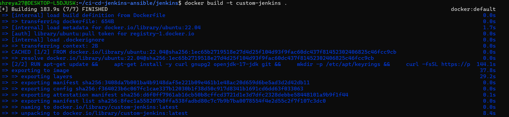
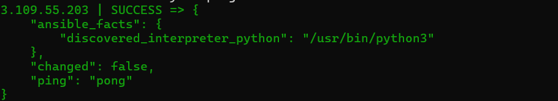
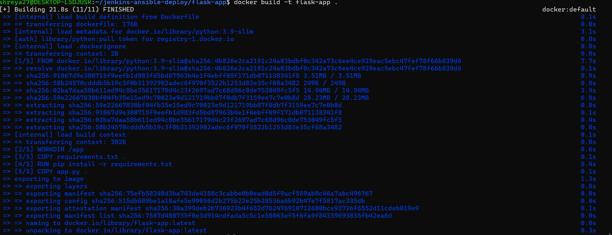
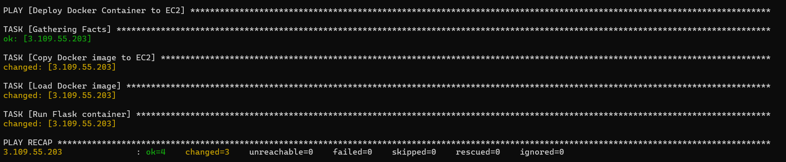
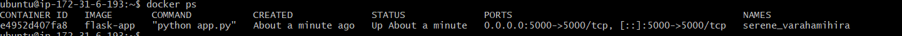
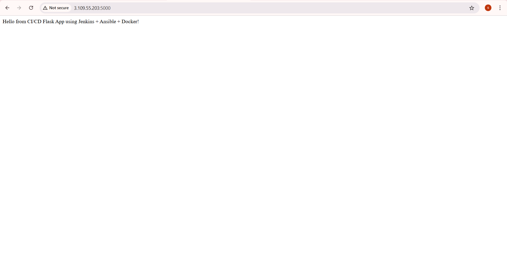

#CI/CD Pipeline with Jenkins + Ansible + Docker for Flask App
In this project, I implemented a basic CI/CD pipeline using Jenkins, Docker, and Ansible. Jenkins was used to automate the pipeline, Docker for containerizing a simple Flask application, and Ansible for deployment on an EC2 instance. The objective was to simulate a practical DevOps pipeline — from code to container to deployment.

## What Was Done
Created a Dockerized Flask app

Wrote a Jenkinsfile to automate image build and deployment

Used Ansible to pull and run the Docker image on EC2

Created a custom Jenkins Docker image to run jobs

Verified app was running via browser and curl

## Project Structure

ci-cd-ansible-jenkins-flask/
├── flask-app/
│   ├── app.py
│   ├── Dockerfile
│   └── requirements.txt
│
├── jenkins/
│   └── Dockerfile
│
├── ansible/
│   ├── inventory
│   └── playbook.yaml
│
├── Jenkinsfile
└── screenshots/

## How It Works
Jenkins container is built using a custom Dockerfile

Jenkins executes the pipeline defined in Jenkinsfile

Pipeline builds the Docker image for the Flask app

Jenkins then triggers Ansible to deploy the built image to EC2

Ansible connects to EC2 and runs the container from the image

The deployed Flask app is verified in the browser

##  Screenshots

Below are the actual screenshots captured during the process. These clearly demonstrate each important step taken in the pipeline:

| Screenshot | Description |
|-----------|-------------|
|  | ✅ **Docker Image Creation for Jenkins** — This shows you manually building a Jenkins base image without using pre-built ones. |
|  | ✅ **Ansible Connectivity Check to EC2** — Confirms successful SSH connectivity from Ansible to your remote EC2 instance. |
|  | ✅ **Docker Image Creation for Flask App** — Shows your Flask app Docker image being built — part of your CI process. |
|  | ✅ **Ansible Deploying Flask App to EC2** — Demonstrates Ansible playbook copying the Flask Docker image to EC2 and running it. |
|  | ✅ **Container Running Confirmation** — Validates that the Flask container is running successfully on the EC2 instance. |
|  | ✅ **Web Output of Deployed App** — Final result of deployment: the live Flask app running on EC2 accessed via browser. |

Conclusion
This project showcases how to combine Jenkins, Docker, and Ansible to build a simple CI/CD pipeline for a Flask application. Even though the actual Jenkins build did not fully succeed, each individual step — from Docker build to Ansible deployment — was verified and demonstrated using screenshots. This helped reinforce my understanding of real-world automation using DevOps tools.

